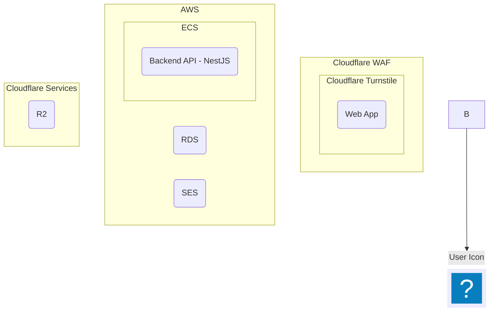
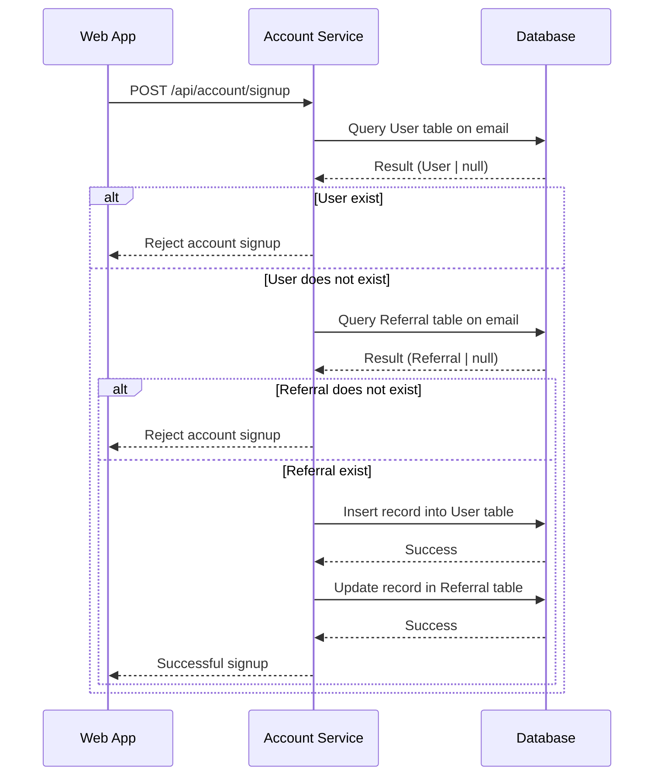
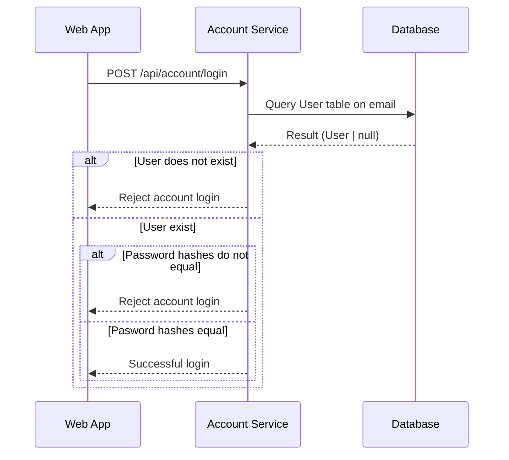
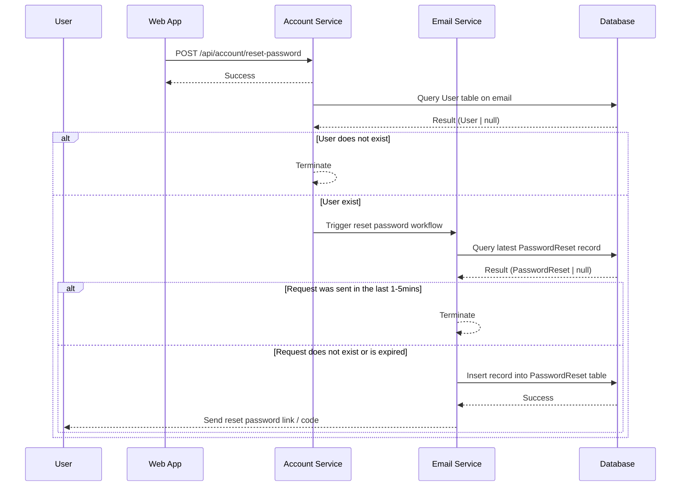
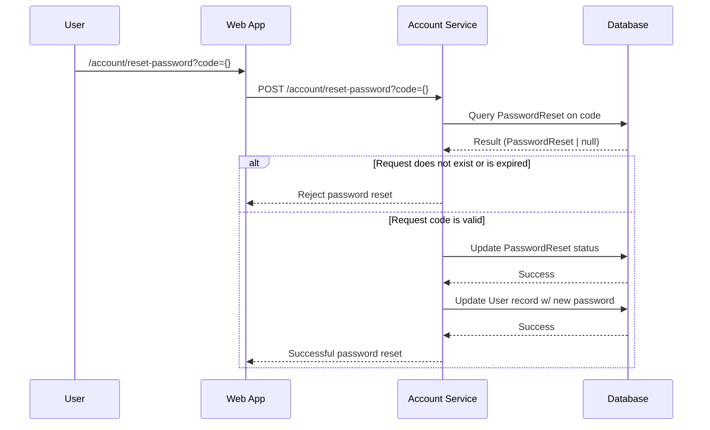
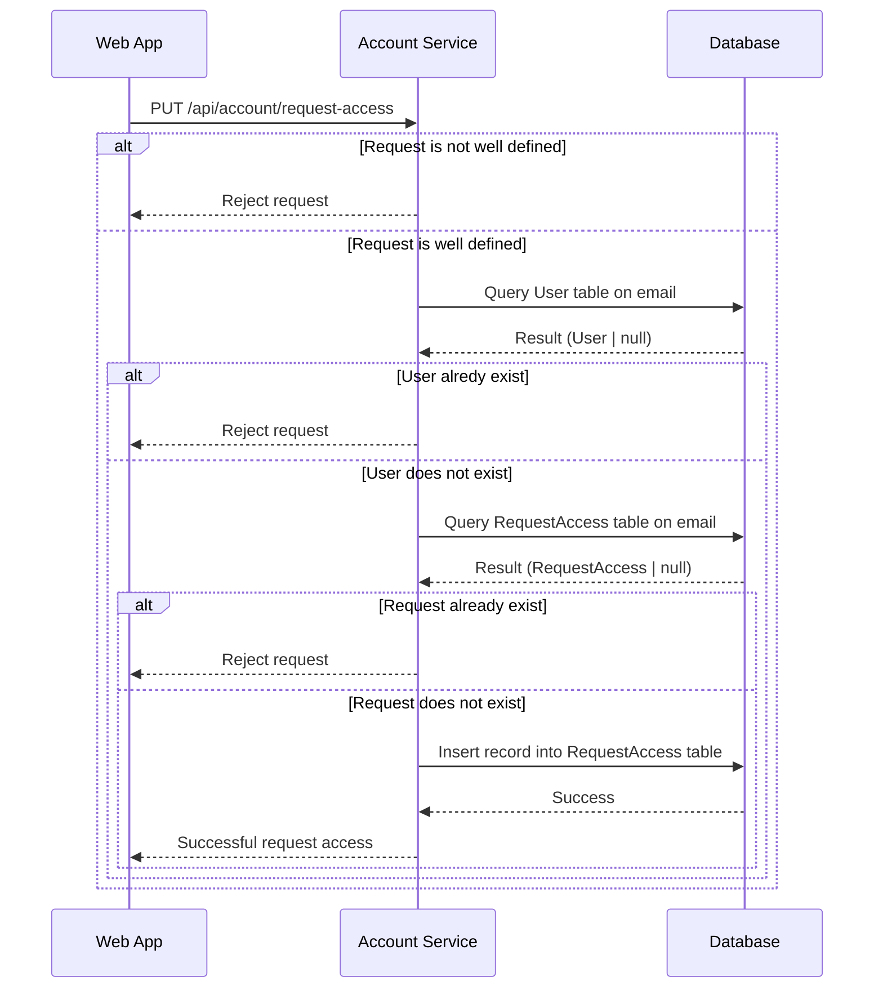
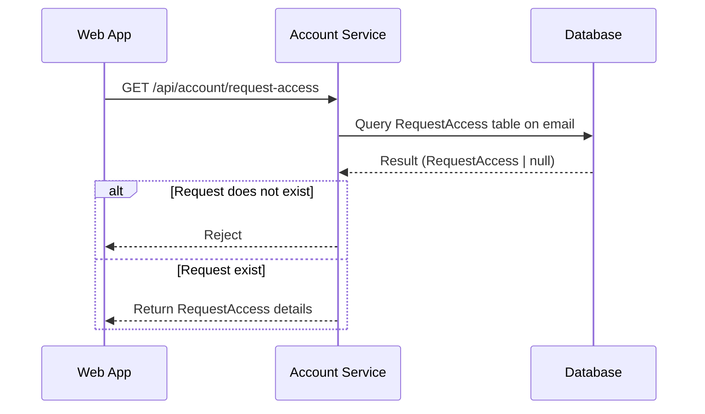
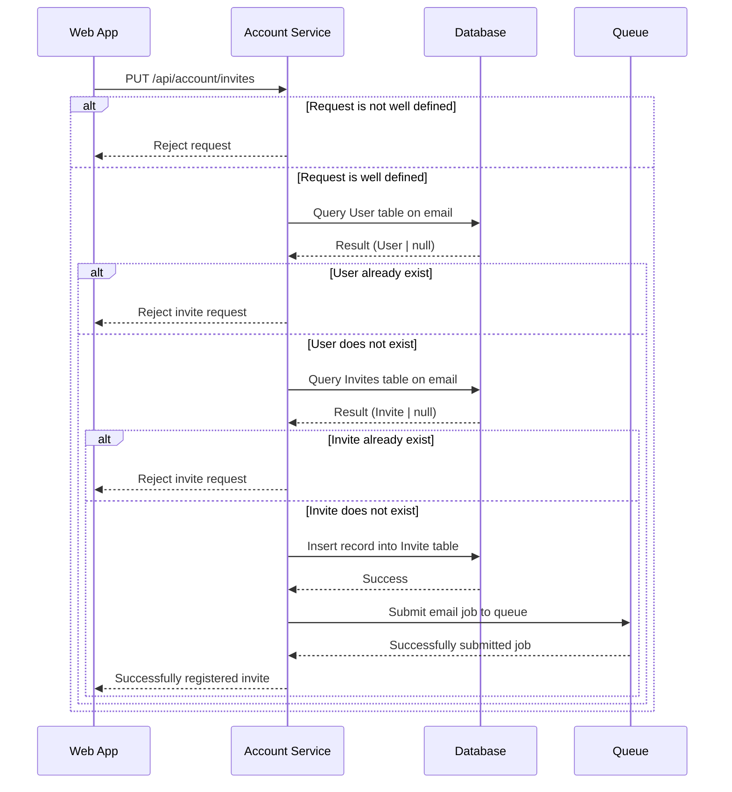
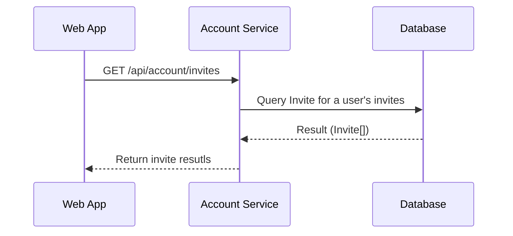
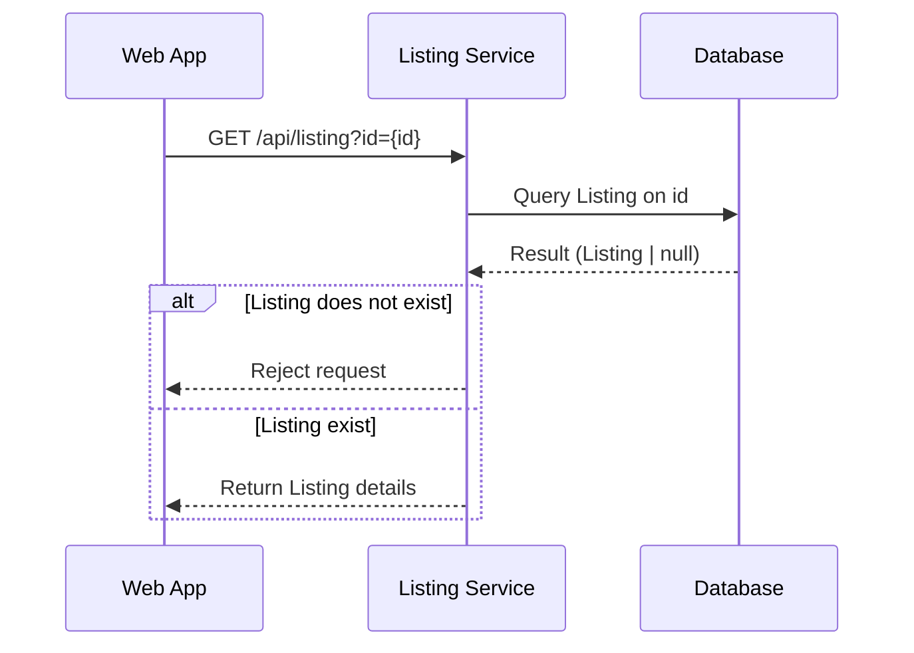

# Backend Architecture

## Motto

_Keep it stupid simple. Or at least try to._

## High-Level Diagram

- We should perform validation on all form submissions
  - Ensure all formats are string
  - Ensure an email address is valid



## Service Analysis

|  Service   | Cloudflare |  Test Text  |
| :--------: | :--------: | :---------: |
| Cloudflare |   Title    | Here's this |
| Paragraph  |    Text    |  And more   |

## Cost Analysis

## DB

- When making queries to the database, let's specify the columns we want to retrieve. Performing a `SELECT *` query has a harmful impact to performance when it comes to large databases
- When performing pagination on listing or messages, let's leverage keyset pagination
  - offset pagination is inefficient because we need to fetch n rows from the disk
  - Through keyset pagination, we jump to where we want to start
    - Note the use of `ORDER BY`

```
SELECT ...
  FROM ...
 WHERE ...
   AND id < ?last_seen_id
 ORDER BY id DESC
 FETCH FIRST 10 ROWS ONLY
```

## Protected Routes

## Request Response

All API responses will have the following schema.

```json
{
 "message": null | string,
 "data": null | object
}
```

We can add another property for displaying messages. `message` can be used for debugging purposes, while `displayMessage` can be used to display an informative message to the user.

```json
{
 "message": null | string,
 "displayMessage": null | string,
 "data": null | object
}
```

## Account Service

For authentication, we will leverage [supabase](https://supabase.com/auth). Supabase provides an out-of-the-box API for authenticating with different providers (including email + password). Supabase Auth leverages JWTs for authentication and provides a multitude of features, such as [Multi-Factor Authentication](https://supabase.com/docs/guides/auth/auth-mfa).

These are high-level diagrams. Implementation may differ based on Supabase's API.

### Signup w/ Email + Password

Reference this [page](https://supabase.com/docs/guides/auth/passwords#signing-up-with-an-email-and-password) for how this can be implemented.

```json
// POST /api/account/signup
{
 "firstName": "John",
 "lastName": "Doe",
 "email": "test@email.com",
 "password": "password123"
}

// HTTP 400
{
 "message": "An account with the specified email already exist.",
 "data": null
}

// HTTP 404
{
 "message": "No invite for the specified email address has been found.",
 "data": null
}

// HTTP 201
{
 "message": "Successfully registered account!"
 "data": null
}
```

TODO: what if the referral expired.

TODO: perform password validation



### Login w/ Email + Password

Reference this [page](https://supabase.com/docs/guides/auth/passwords#signing-in-with-an-email-and-password) for how this can be implemented.

```json
// POST /api/account/login
{
 "email": "test@email.com",
 "password": "password123"
}

// HTTP 400
{
 "message": "The specified account credentials are incorrect.",
 "data": null
}

// HTTP 200
{
 "message": "Sucessfully logged in!",
 "data": {
  "token": "..."
 }
}
```



### Reset Password w/ Email + Password (Part 1)

Reference this [page](https://supabase.com/docs/guides/auth/passwords#resetting-a-password) for how this can be implemented.

```json
// POST /api/account/reset-password
{
 "email": "test@email.com"
}

// HTTP 200
{
 "message": "If an account exist, we’ll send an email with a link to reset your password.",
 "data": null
}
```



### Reset Password w/ Email + Password (Part 2)

Reference this [page](https://supabase.com/docs/guides/auth/passwords#resetting-a-password) for how this can be implemented.

```json
// UPDATE / PUT / PATCH /api/account/reset-password?code={}
{
 "newPassword": "password1234"
}

// HTTP 404
{
 "message": "The specified code is expired or does not exist.",
 "data": null
}

// HTTP 200
{
 "message": "Successfully reset password!",
 "data": null
}
```



### Requesting Access

- Before doing anything, validate the data.
- We don't have to specify email because we retrieve that from the request (JWT).
- Maybe this can be a protected route that only certain users can hit
  - This is an alternative to querying the User table every time

```json
// PUT /api/account/request-access
{
  "firstName": "Jon",
  "lastName": "Cruz",
  "reason": "I wan't to become a vendor on the platform!"
}

// HTTP 400@
{
  "message": "Request is missing email, a reason of at least 200 characters...",
  "data": null
}


// HTTP 403
{
  "message": "A user account with this email already exist.",
  "data": null
}

// HTTP 403 or 400
{
  "message": "A request from this email has already been submitted!",
  "data": null
}

// HTTP 200
{
  "message": "Successfully submitted your request!",
  "data": null
}
```



### Get Request Access

- We need a way to retrieve the request.
  - Retrieving the request will allow us to determine whether to proceed with onboarding.
- We will fetch the user email from the request (JWT).

```json
// GET /api/account/request-access

// HTTP 400
{
  "message": "No request has been submitted using this email.",
  "data": null
}

// HTTP 200
{
  "message": null,
  "data": {
    "firstName": "Jon",
    "lastName": "Cruz",
    "reason": "I want to become a vendor on the platform!",
    "status": "PENDING"
  }
}
```



### Sending an invite

- Let's have queue process async work (jobs).
  - In this case, the job will be submit an email containing the invite.

```json
// PUT /api/account/invites
{
  "email": "jc1831@rit.edu",
  "reason": "He is a cool guy"
}

// HTTP 400
{
  "message": "Request is missing a valid email address, a reason of at least 200 characters...",
  "data": null
}

// HTTP 400
{
  "message": "The specified email is linked to an existing user.",
  "data": null
}

// HTTP 400
{
  "message": "An invite for the specified email has already been sent.",
  "data": null
}

// HTTP 200
{
  "message": "Successfully sent an invite!",
  "data": null
}
```



### Getting invites

```json
// GET /api/account/invites

// HTTP 200
{
  "message": null,
  "data": {
    "invites": [
      {
        "email": "jc1831@rit.edu",
        "reason": "He is a cool guy",
        "invitedOn": "...",
        "joinedOn": "..."
      }
    ]
  }
}
```



### Account Details

- Used to fetch user details

```json
// GET /api/account/details

// HTTP 200
{
  "message": null,
  "data": {
    "firstName": "Jon",
    "lastName": "Cruz",
    "email": "jc1831@rit.edu",
    "accountType": "...",
    "joinedOn": "...",
    "organization": {
      "name": "..."
    }
  }
}
```

## Connections

## Listings

### Get listings

When fetching for listings, we don't want to return ALL listings. Doing so is inefficient, so we need to introduce proper filtering and pagination. The following are some constraints we should impose.

- Limit the number of results to an upper bound of 250
  - We can revisit this once we have better metrics on how big the data is
- A query should specify a latitude and longitude
- A query should specify a radius (default 25 miles)

Here are some parameters:

- radius: number - How far to search for items
- latitude: number - Used to determine center of radius
- longitude: number - Used to determined center of radius
- count: number - How many results to return
- query: string - The text to query on
- nextToken: number | string - Where to start the pagination from

```json
// GET /api/listings?radius=25&latitude=43.0&longitude=-77.6&count=50&query=Tires
{
 "message": null,
 "data": {
  "count": 50,
  "hasNext": true,
  "nextToken": "251",
  "results": [{
   ...
  }]
 }
}

// GET /api/listings?radius=25&latitude=43.0&longitude=-77.6&count=50&query=Tires&nextToken=id251
{
 "message": null,
 "data": {
  "count": 13,
  "hasNext": false,
  "startAt": null,
  "results": [{
   ...
  }]
 }
}
```

#### Searching

- pre-compute vector
- index column
- coalesce column if it can be null
- `to_tsquer(text)`
- `to_tsvector(attr1 || ' ' || attr2 || ... )`
- `where document @@ to_tsquery(text)`
- You can do half queries using 'isl:_' , this will return everything that starts with 'isl'. If you want a multiword search, add <-> in between the words i.e 'sea <-> mon:_'. This will return the row with 'Sea Monster'

#### Ranking

- `ts_rank()`
- `where document @@ plainto_tsquery(text) order by ts_rank(document, plainto_tsquery(text))`
- `ts_rank_cd` (another one)
- we can set a weight to columns
- `setweight(to_tsvector(column), rank ['A']) || ...`

#### Trigger

-

### Get a listing

```json
// GET /api/listing?id={id}

// HTTP 404
{
 "message": "A listing with the specified id does not exist.",
 "data": null
}

// HTTP 200
{
 "message": null,
 "data": {
  ...
 }
}
```



### Create a listing

```json
// POST /api/listing
{
 "attachments": [ ... ],
 "inventoryItemId": "1",
 "quantity": 3,
 "zipCode": "14526",
 "tags": [...]
}
```

### Update a list

### Delete a listing
