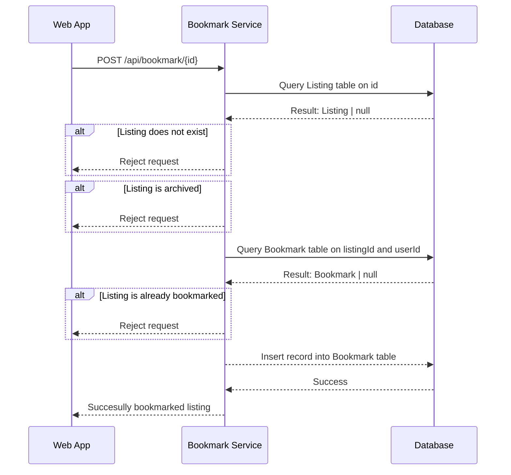
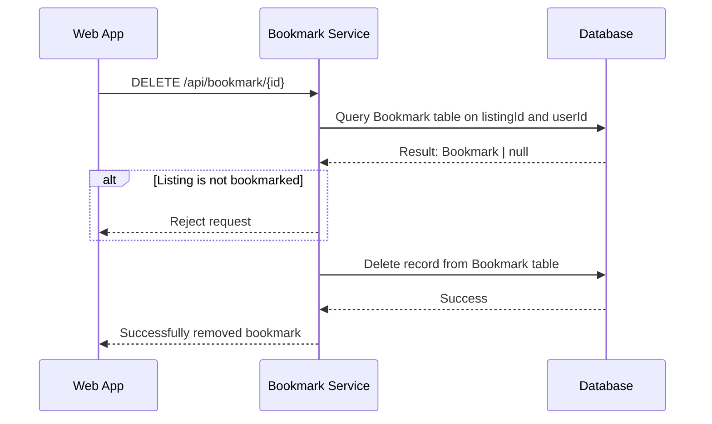
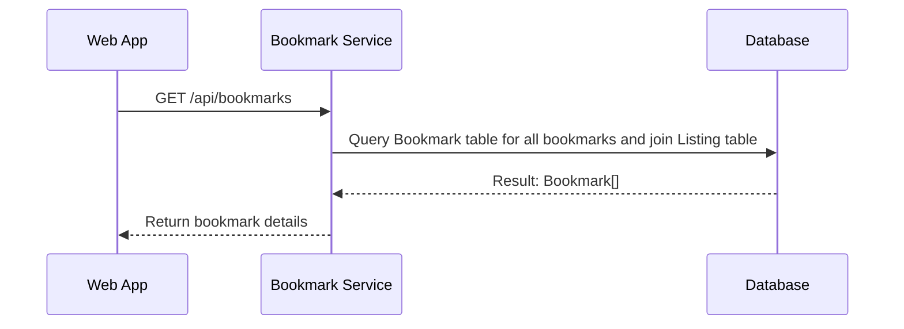

# Bookmark Endpoints

## Contents

- [Bookmarks](#bookmarks)
  - [Bookmark a Listing](#bookmark-a-listing)
  - [Remove Bookmarked Listing](#remove-bookmarked-listing)
  - [Get Bookmarked Listings](#get-bookmarked-listings)

## Bookmarks

- Minimum Role: `User`
- Notes:
  - I wonder whether we want to perform a query on whether the listing is already bookmarked or not.
    - It may be redundant, but it could also be a good UX.

### Bookmark a Listing

```json
// POST /api/bookmark/{id}

// HTTP 400
{
  "message": "Listing does not exist.",
  "data": null
}

// HTTP 400
{
  "message": "Listing is archived.",
  "data": null
}

// HTTP 400
{
  "message": "Listing is already bookmarked.",
  "data": null
}

// HTTP 200
{
  "message": "Successfully bookmarked listing!",
  "data": null
}
```



### Remove Bookmarked Listing

- Same question here, should we check whether the listing is bookmarked or not?

```json
// DELETE /api/bookmark/{id}

// HTTP 400
{
  "message": "Listing is not bookmarked.",
  "data": null
}

// HTTP 200
{
  "message": "Successfully removed bookmark!",
  "data": null
}
```



### Get Bookmarked Listings

- Notes:
  - When we query the Bookmark table, ensure we JOIN the Listing table to get the listing details.
  - Ensure proper pagination is implemented.
  - Make sure you don't show archived listings.

```json
// GET /api/bookmarks

// HTTP 200
{
 "message": null,
 "data": {
  "count": 50,
  "hasNext": true,
  "nextToken": "251",
  "results": [{
    ...
  }]
 }
}
```


