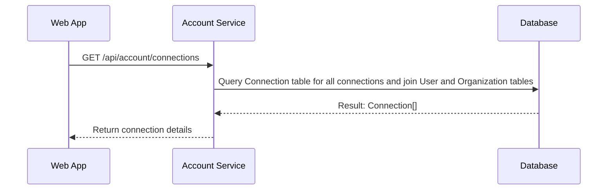
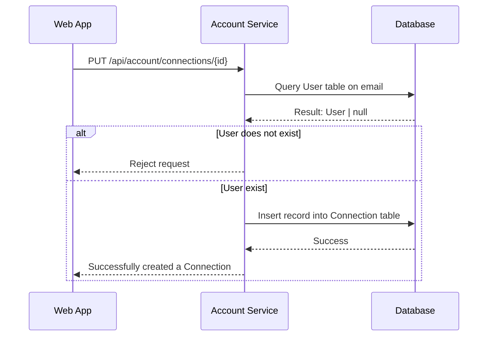
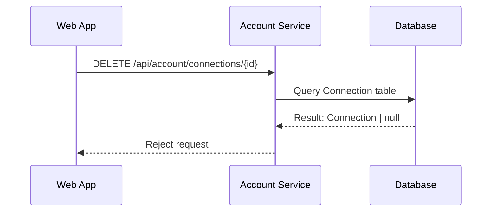

# Account Endpoint

## Contents

- [Connections](#connections)
  - [Get Connections](#get-connections)
  - [Create a Connection](#create-a-connection)
  - [Remove a Connection](#remove-a-connection)

## Connections

- Minimum Role: `User`
- Notes:
  - A connection is a relationship between two users. A user can have multiple connections. A connection is a one-way relationship. If user A is connected to user B, user B is not necessarily connected to user A.

### Get Connections

- Notes: Make sure we JOIN on the User (and possible Organization) table to get details about the connection.

```json
// GET /api/connections

// HTTP 200
{
  "message": null,
  "data": {
    "connections": [
      {
        "id": "connectionId",
        "user": {
          "id": "userId",
          "firstName": "firstName",
          "lastName": "lastName",
          "username": "username",
          "displayName": "displayName",
          "organization": {
            "id": "organizationId",
            "name": "organizationName"
          }
        }
      }
    ]
  }
}
```



### Create a Connection

- We will create a connection with the specified user id

```json
// PUT /api/connections/
{
  "userId": "userId"
}

// HTTP 400
{
  "message": "User does not exist",
  "data": null
}

// HTTP 200
{
  "message": "Successfully created a connection.",
  "data": {
    "id": "connectionId",
    "user": {
      "id": "userId",
      "firstName": "firstName",
      "lastName": "lastName",
      "username": "username",
      "displayName": "displayName",
      "organization": {
        "id": "organizationId",
        "name": "organizationName"
      }
    }
  }
}
```



### Remove a Connection

- We need to check whether the connection exists before removing it.
  - Can this be done in one query?

```json
// DELETE /api/connections/{id}

// HTTP 400
{
  "message": "Specified connection does not exist",
  "data": null
}

// HTTP 200
{
  "message": "Successfully removed a connection!",
  "data": null
}
```


