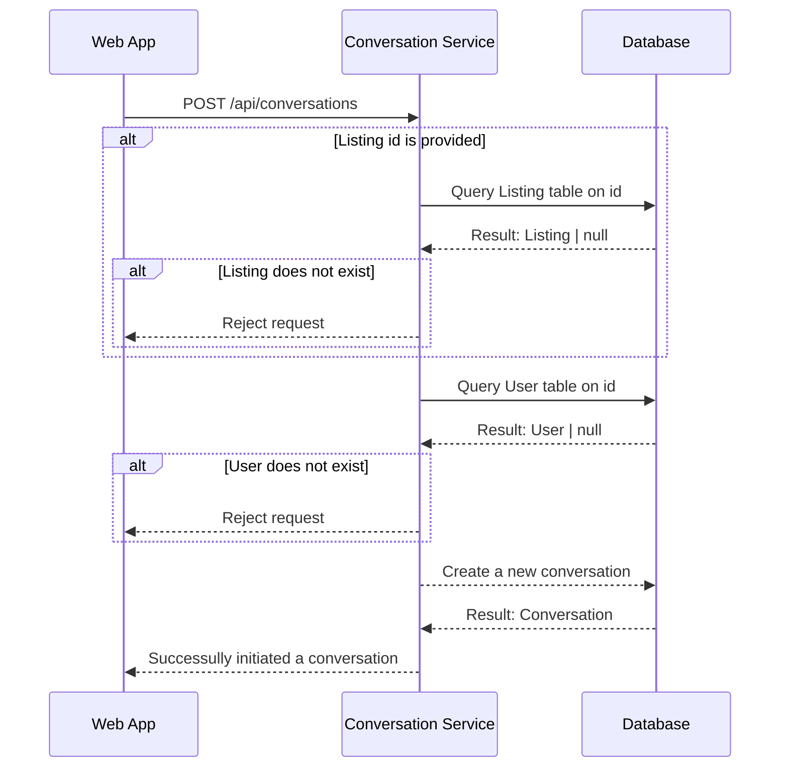
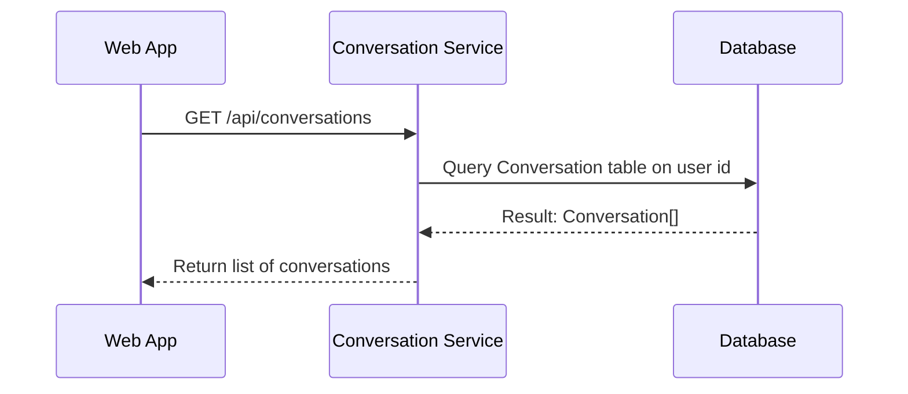

# Conversation Endpoint

## Contents

## Orders

- Minimum Role: `User`
- Notes:
  - The DB is a bit confusing here. Who do we initiate the conversation with?

### Initiate a Conversation

- Notes:
  - We need to discuss who we initiate the conversation with, since listings/orders belong to an organization.

```json
// POST /api/conversations
{
  "listingId": str | null,
  "userId": str,
}

// HTTP 404
{
  "message": "The specified listing does not exist.",
  "data": null
}

// HTTP 404
{
  "message": "The specified user does not exist.",
  "data": null
}

// HTTP 201
{
  "message": "Conversation initiated.",
  "data": null
}
```



### Get Conversations

- Notes:
  - Suppose conversations are between users.
    - Here, we fetch the user's conversations.

```json
// GET /api/conversations

// HTTP 200
{
  "message": null,
  "data": {
    "count": 50,
    "hasNext": true,
    "nextToken": "251",
    "results": [{
      ...
    }]
  }
}
```



### Send a Message

```json
// POST /api/conversations/{id}/messages
{
  "content": str,
  "attachments": str[]
}
```
