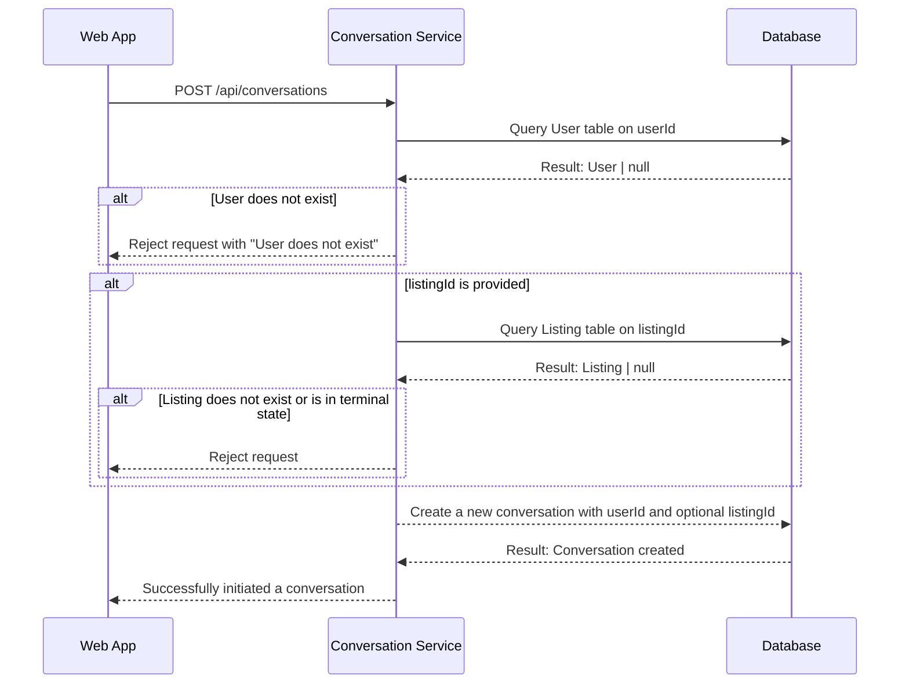
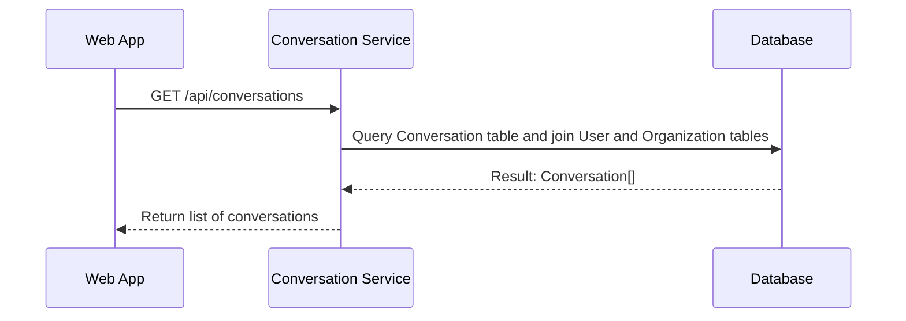
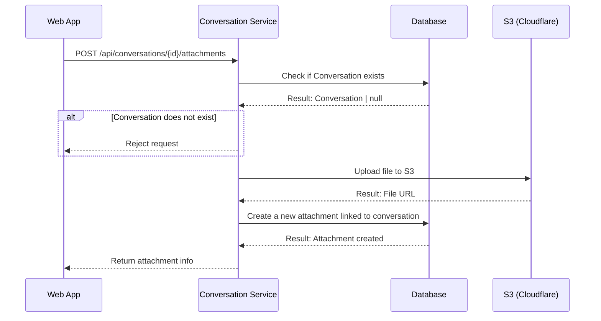
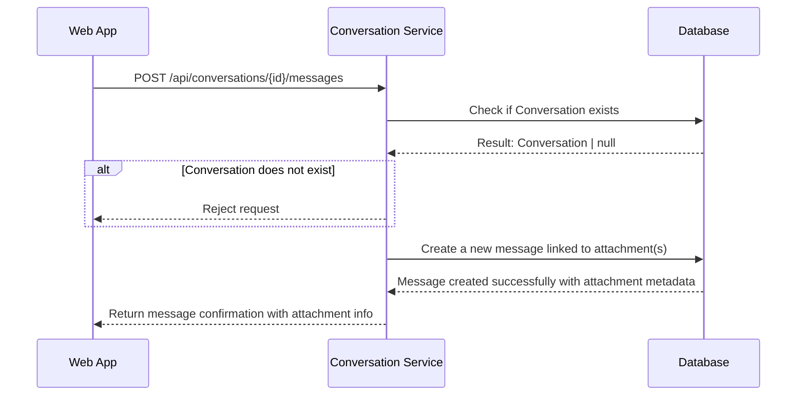
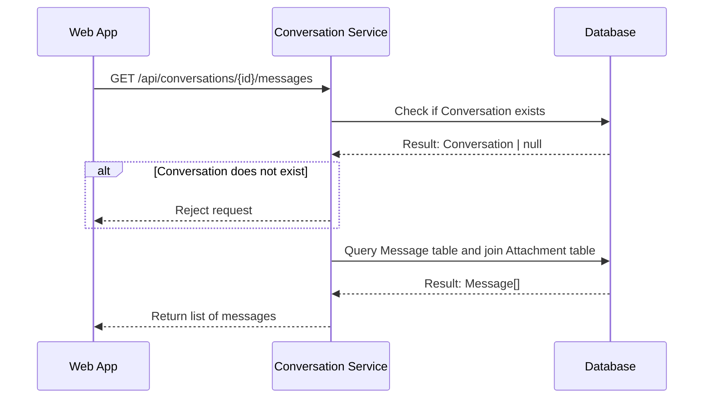
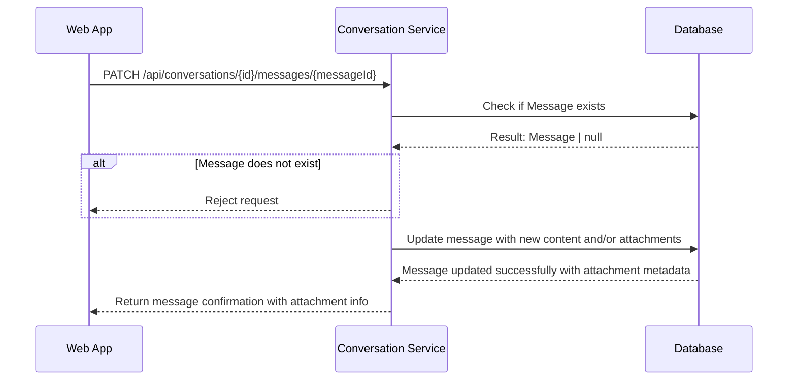
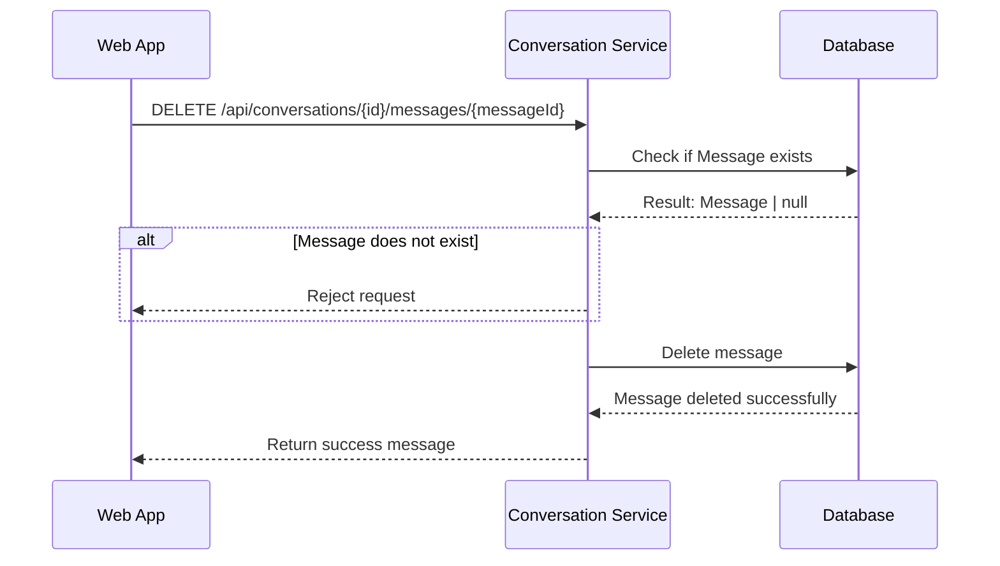

# Conversation Endpoint

- Minimum Role: `User`

## Contents

- [Conversation](#conversation)
  - [Initiate a Conversation](#initiate-a-conversation)
  - [Get Conversations](#get-conversations)
  - [Add attachments to a message](#add-attachments-to-a-message)
  - [Send a Message](#send-a-message)
  - [Get Messages](#get-messages)
  - [Update a Message](#update-a-message)
  - [Delete a Message](#delete-a-message)

## Conversation

- Minimum Role: `User`

### Initiate a Conversation

```json
// POST /api/conversations
{
  "userId": str,
  "listingId": str | null
}

// HTTP 400 (if userId is missing)
{
  "message": "userId is required.",
  "data": null
}

// HTTP 404 (if userId is invalid)
{
  "message": "The specified user does not exist.",
  "data": null
}

// HTTP 404 (if listingId is provided but invalid
// (consider listings in terminal state)
{
  "message": "The specified listing does not exist.",
  "data": null
}

// HTTP 201
{
  "message": "Conversation initiated.",
  "data": {
    "id": "conversationId",
    "listingId": "listingId" | null,
    "user": {
      "id": "userId",
      "firstName": "firstName",
      "lastName": "lastName",
      "username": "username",
      "displayName": "displayName",
      "organization": {
        "id": "organizationId",
        "name": "organizationName"
      }
    }
  }
```



### Get Conversations

```json
// GET /api/conversations?nextToken={nextToken}&count={count}

// HTTP 200
{
  "message": null,
  "data": {
    "count": 50,
    "hasNext": true,
    "nextToken": "251",
    "results": [
      {
        "id": "conversationId",
        "listingId": "listingId",
        "user": {
          "id": "userId",
          "firstName": "firstName",
          "lastName": "lastName",
          "username": "username",
          "displayName": "displayName",
          "organization": {
            "id": "organizationId",
            "name": "organizationName"
          }
        }
      }
    ]
  }
}
```



### Add attachments to a message

- The file should be uploaded to S3 and the attachment metadata should be saved in the database.
- This is a different endpoint from sending a message because the file upload is a separate process.

```json
// POST /api/conversations/{id}/attachments
{
  // For binary data, you'd use multipart/form-data
  "file": <binary data>
}

// HTTP 404
{
  "message": "Conversation not found.",
  "data": null
}

// HTTP 400
{
  "message": "File is required.",
  "data": null
}

// HTTP 413
{
  "message": "File size exceeds the limit.",
  "data": null
}

// HTTP 415 (consider HEIC)
{
  "message": "Unsupported file type.",
  "data": null
}

// HTTP 201
{
  "message": "Attachment uploaded successfully.",
  "data": {
    "attachmentId": "attachmentId",
    "fileUrl": "fileUrl",
    "fileName": "fileName",
    "fileSize": 0,
    "fileType": "fileSize"
  }
}
```



### Send a Message

- Either `content` or `attachments` must be provided.

```json
// POST /api/conversations/{id}/messages
{
  "content": "content",
  "attachments": ["attachmentId"]
}

// HTTP 404
{
  "message": "Conversation not found.",
  "data": null
}

// HTTP 400 (require content or attachments)
{
  "message": "Cannot send an empty message.",
  "data": null
}

// HTTP 201
{
  "message": "Message sent successfully.",
  "data": {
    "messageId": "messageId",
    "content": "content",
    "attachments": [
      {
        "attachmentId": "attachmentId",
        "fileUrl": "fileUrl",
        "fileName": "fileName",
        "fileSize": 0,
        "fileType": "fileSize"
      }
    ]
  }
}
```



### Get Messages

- The messages should be ordered by the `createdAt` timestamp in descending order.
  - The first element in the array should be the most recent message.

```json
// GET /api/conversations/{id}/messages?nextToken=15&count=10

// HTTP 200
{
  "message": null,
  "data": {
    "count": 10,
    "hasNext": true,
    "nextToken": "15",
    "results": [
      {
        "messageId": "msg123",
        "content": "Here's a photo",
        "attachments": [
          {
            "attachmentId": "abc123",
            "fileUrl": "https://api.example.com/attachments/abc123",
            "fileName": "image.jpg",
            "fileSize": 2048,
            "fileType": "image/jpeg"
          }
        ]
      }
    ]
  }
}
```



### Update a Message

- The values passed into the request body are what will be updated. For example, an empty `content` will remove the content of the message. An empty `attachments` will remove all attachments from the message.
  - If you want to remove a specific attachment, you will need to pass in all the other attachments and exclude the one you want to remove.
  - You cannot add new attachments to a message.
  - Either `content` or `attachments` must be provided.
  - The updated record must not have an empty `content` and `attachments` (one of them must be non-empty).

```json
// PATCH /api/conversations/{id}/messages/{messageId}
{
  "content": "content",
  "attachments": ["attachmentId"]
}

// HTTP 404
{
  "message": "Message not found.",
  "data": null
}

// HTTP 400
{
  "message": "Cannot update to an empty message.",
  "data": null
}

// HTTP 200
{
  "message": "Message updated successfully.",
  "data": {
    "messageId": "messageId",
    "content": "content",
    "attachments": [
      {
        "attachmentId": "attachmentId",
        "fileUrl": "fileUrl",
        "fileName": "fileName",
        "fileSize": 0,
        "fileType": "fileSize"
      }
    ]
  }
}
```



### Delete a Message

- Deleting a message will remove the message from the conversation.

```json
// DELETE /api/conversations/{id}/messages/{messageId}

// HTTP 404
{
  "message": "Message not found.",
  "data": null
}

// HTTP 200
{
  "message": "Message successfully deleted.",
  "data": null
}
```


