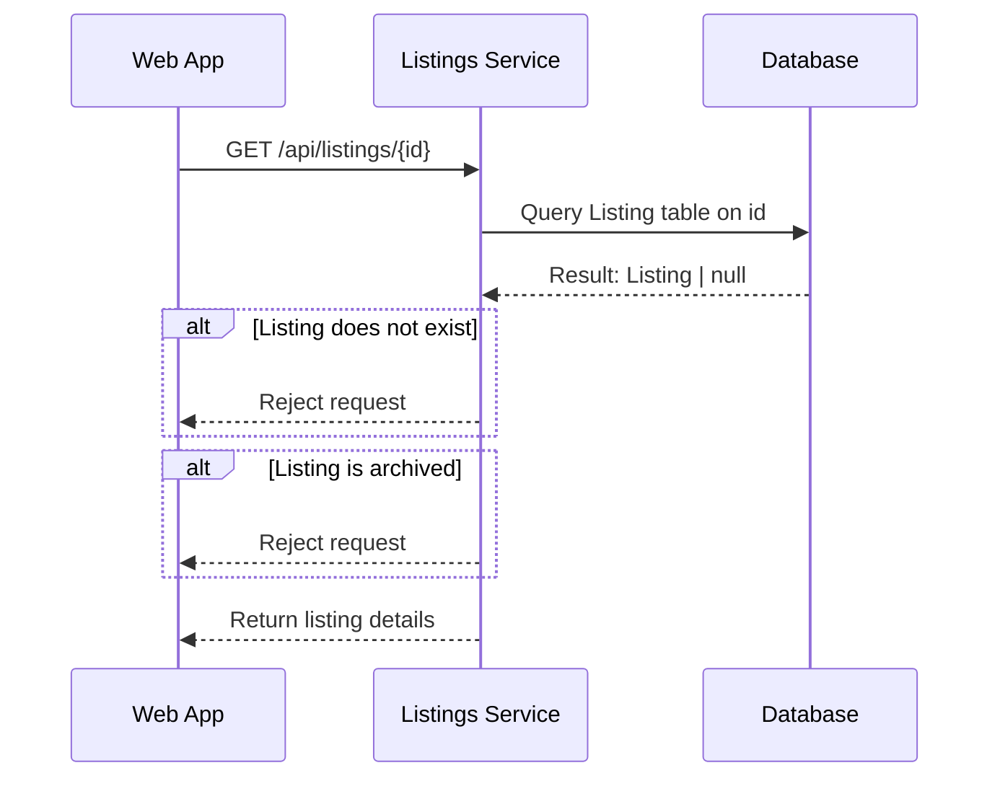
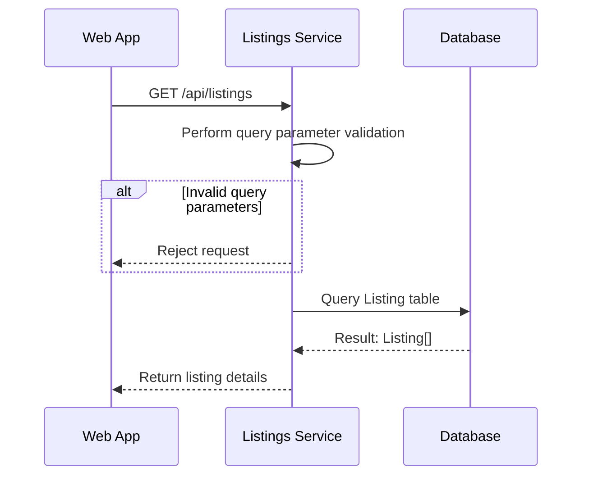
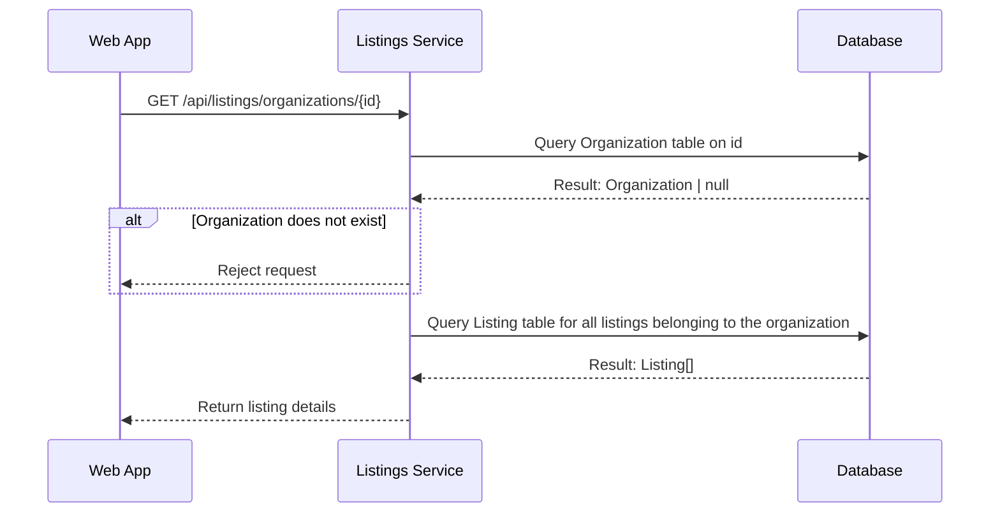
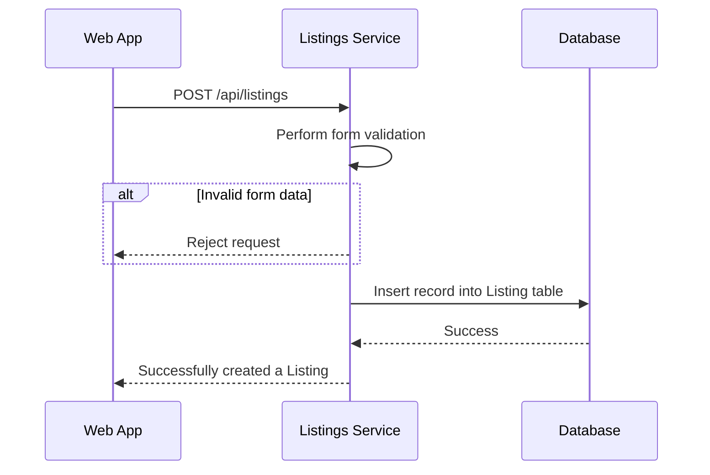
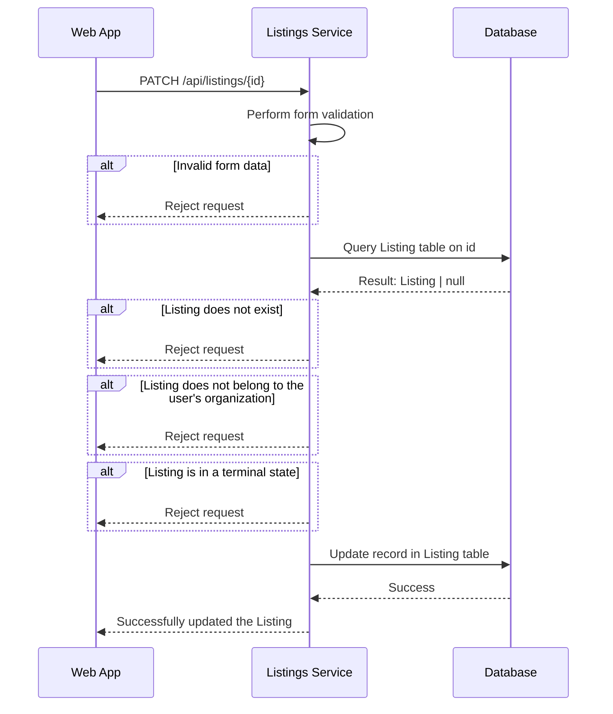

# Listings Endpoint

## Contents

- [Listings](#listings)
  - [Get Listings](#get-listings)
  - [Create a Listing](#create-a-listing)
  - [Update a Listing](#update-a-listing)
  - [Other (ignore for now)](#other-ignore-for-now)

## Listings

- Minimum Role: `User`
- Notes:

  - When fetching for listings, we don't want to return ALL listings. Doing so is inefficient, so we need to introduce proper filtering and pagination. The following are some constraints we should impose.

    - Limit the number of results to an upper bound of 250
      - We can revisit this once we have better metrics on how big the data is
    - A query should specify a latitude and longitude
    - A query should specify a radius (default 25 miles)

  - Here are some parameters:

    - radius: number - How far to search for items
    - latitude: number - Used to determine center of radius
    - longitude: number - Used to determined center of radius
    - count: number - How many results to return
    - query: string - The text to query on
    - nextToken: number | string - Where to start the pagination from

  - Here are some resources we may need:

    - https://postgis.net
    - https://dba.stackexchange.com/questions/179598/how-can-i-use-a-full-text-search-on-a-jsonb-column-with-postgres
    - https://github.com/pgvector/pgvector
    - https://www.postgresql.org/docs/current/pgtrgm.html
    - https://www.postgresql.org/docs/current/textsearch.html

  - For the time being, we will implement FTS on PSQL, rather than using a dedicated search engine or leveraging OpenAI.
    - Leveraging a search engine requires data synchronization between the data stores, which adds complexity.
      - This also comes at an expensive cost.
    - While OpenAI is cheap, it may be overkill to what we want to achieve.
      - This can be something we can explore if FTS does not meet our needs.

### Get a Listing

```json
// GET /api/listings/{id}

// HTTP 404
{
  "message": "A listing with the specified ID does not exist.",
  "data": null
}

// HTTP 403
{
  "message": "You do not have permission to view this listing.",
  "data": null
}

// HTTP 200
{
  "message": null,
  "data": {
    ...
  }
}
```



### Get Listings

- Notes:
  - Seaching will be vector based. Please ensure how searching will work before implementing (or at least have an idea).
    - Include all properties in the search when querying database.
  - Ensure proper pagination is implemented.
  - Ensure we properly handle query parameters.

```json
// GET /api/listings?radius={radius}&latitude={latitude}&longitude={longitude}&count={count}&query={query}&nextToken={nextToken}&sort={sort}&filter={filter}

// HTTP 400
{
  "message": "Invalid query parameters.",
  "data": {
    "latitude": "Latitude is required.",
    "longitude": "Longitude is required."
  }
}

// HTTP 200
{
 "message": null,
 "data": {
  "count": 50,
  "hasNext": true,
  "nextToken": "251",
  "results": [{
    ...
  }]
 }
}
```



### Get Organizations Listings

```json
// GET /api/listings/organizations/{id}

// HTTP 404
{
  "message": "An organization with the specified ID does not exist.",
  "data": null
}

// HTTP 200
{
  "message": null,
  "data": {
    "count": 50,
    "hasNext": true,
    "nextToken": "251",
    "results": [{
      ...
    }]
  }
}
```



### Create a Listing

- Notes:
  - A listing will be mapped to the user's organization.

```json
// POST /api/listings
{
  "title": str,
  "description": str,
  "attributes": object,
  "quantity": int,
  "latitude": 0.0,
  "longitude": 0.0,
  "inventoryItemId": int,
}

// HTTP 400
{
  "message": "Invalid form data.",
  "data": {
    "title": "Title is required.",
    "description": "Description is required.",
    "attributes": "Attributes are required.",
    "quantity": "Quantity is required.",
    "latitude": "Latitude is required.",
    "longitude": "Longitude is required.",
    "inventoryItemId": "Inventory Item ID is required."
  }
}

// HTTP 200
{
  "message": "Successfully created a listing!",
  "data": null
}
```



### Update a Listing

- Notes:
  - The request will specify the attributes that are being updated, alongside the new values.
    - If an update only requires a change to the `title`, then only the `title` property should be specified, alongside the new value.
  - This is how we will update a listings status.
    - `ACTIVE` - The listing can be viewed by others and orders can be placed.
    - `INACTIVE` - The list can be viewed by others, but orders cannot be placed.
    - `COMPLETE` - The listing was fulfilled by an order (out-of-stock). No orders can be placed.
      - This is a terminal state, meaning the listing cannot be updated.
      - Should users be able to view this listing?
    - `ARCHIVED` - The listing cannot be viewed by others and no orders can be placed.
      - This is a terminal state, meaning the listing cannot be updated.

```json
// PATCH /api/listings/{id}
{
  "title": str,
  "description": str,
  "attributes": object,
  "quantity": int,
  "inventoryItemId": int,
  "status": ACTIVE | INACTIVE | COMPLETE | ARCHIVED
}

// HTTP 400
{
  "message": "Invalid form data.",
  "data": {
   "schoolName": "Unknown attribute provided."
  }
}

// HTTP 404
{
  "message": "A listing with the specified ID does not exist.",
  "data": null
}

// HTTP 403
{
  "message": "You do not have permission to update this listing.",
  "data": null
}

// HTTP 403
{
  "message": "The listing is in a terminal state and cannot be updated.",
  "data": null
}

// HTTP 200
{
  "message": "Successfully updated the listing!",
  "data": null
}
```



### Other (ignore for now)

#### Searching

- pre-compute vector
- index column
- coalesce column if it can be null
- `to_tsquer(text)`
- `to_tsvector(attr1 || ' ' || attr2 || ... )`
- `where document @@ to_tsquery(text)`
- You can do half queries using 'isl:_' , this will return everything that starts with 'isl'. If you want a multiword search, add <-> in between the words i.e 'sea <-> mon:_'. This will return the row with 'Sea Monster'

#### Ranking

- `ts_rank()`
- `where document @@ plainto_tsquery(text) order by ts_rank(document, plainto_tsquery(text))`
- `ts_rank_cd` (another one)
- we can set a weight to columns
- `setweight(to_tsvector(column), rank ['A']) || ...`

#### Trigger

- Allowing for real-time updates to the vector column
- `create trigger ... before insert or update on ... for each row execute procedure ...`
