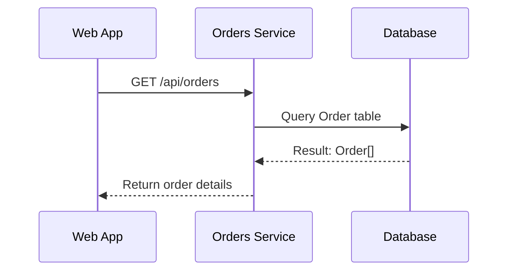
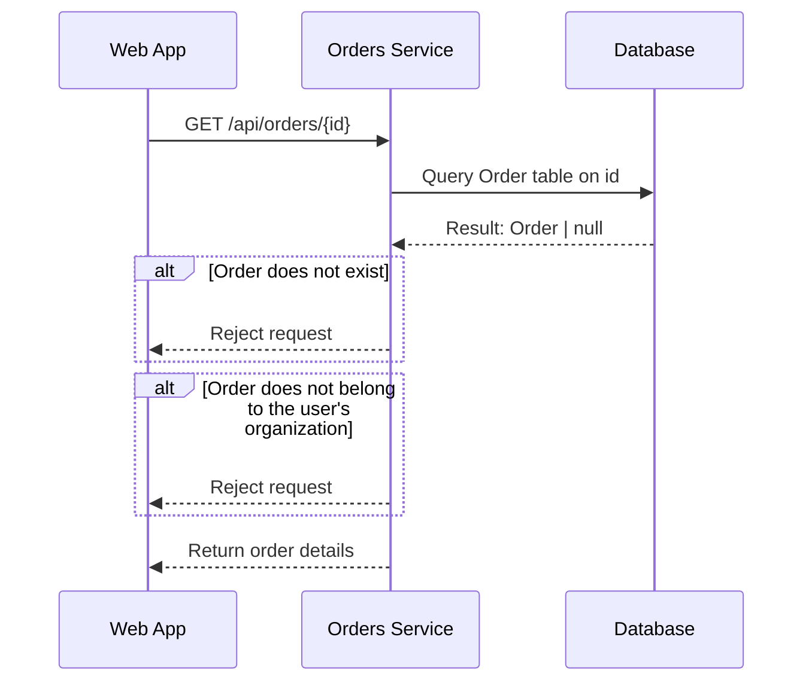
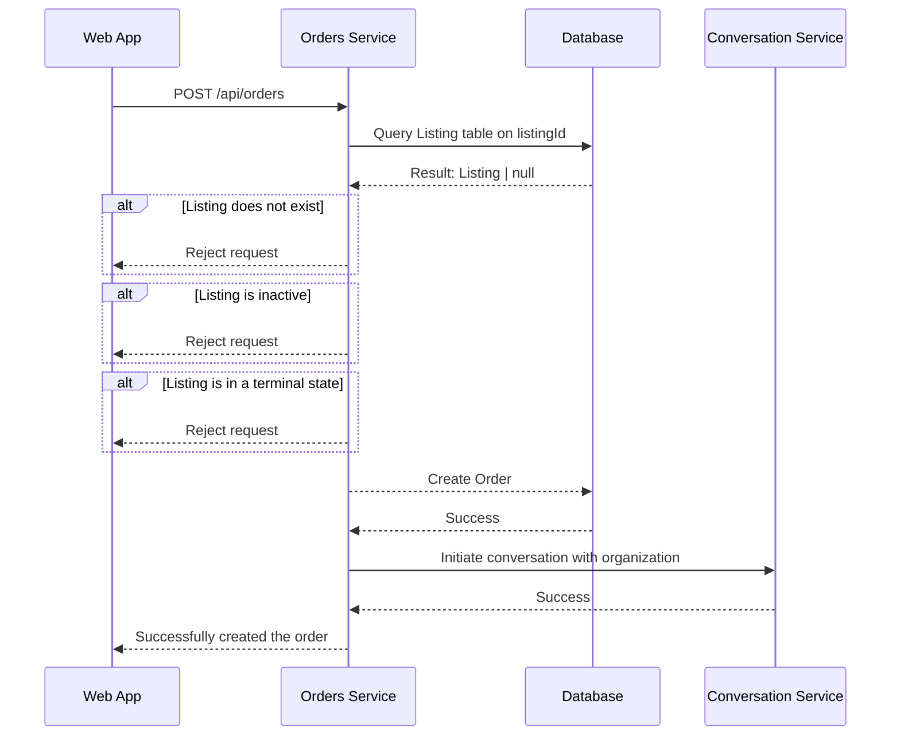
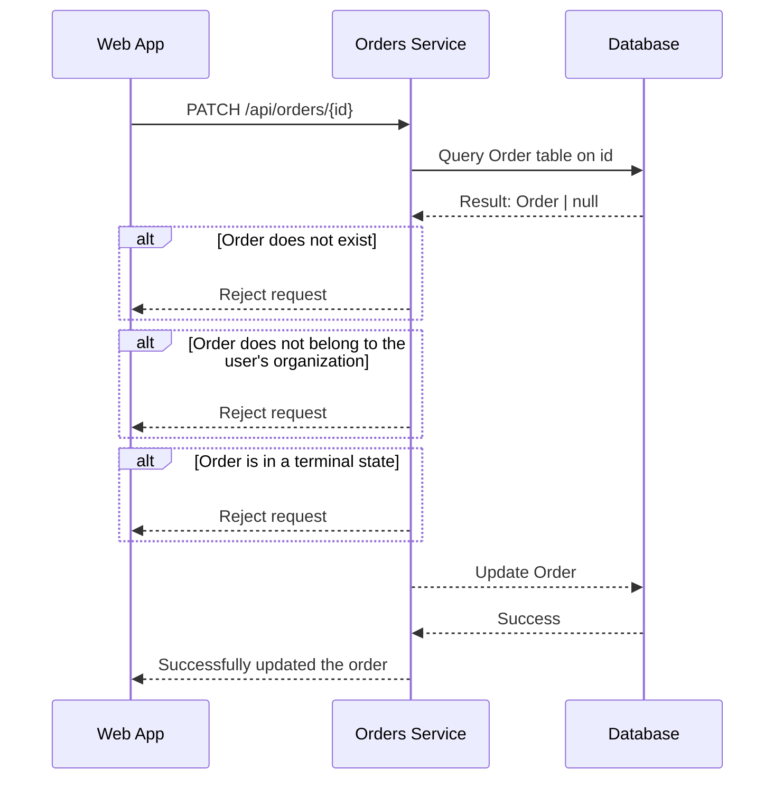
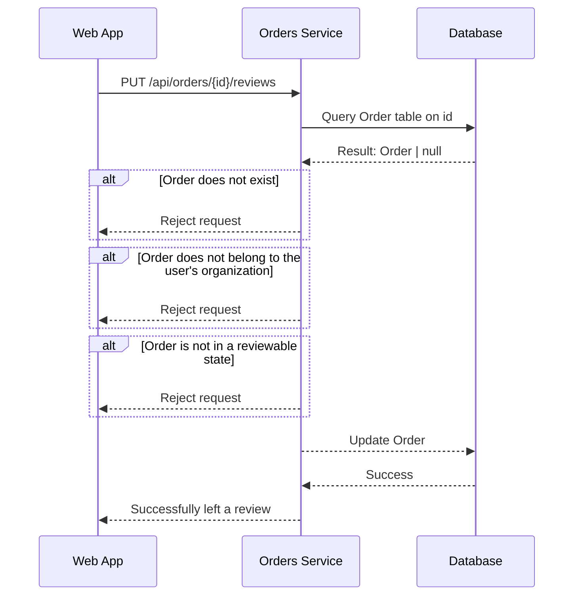

# Orders Endpoint

## Contents

- [Get Orders](#get-orders)
- [Get an Order](#get-an-order)
- [Creating an Order](#creating-an-order)
- [Updating an Order](#updating-an-order)
- [Leaving a Review](#leaving-a-review)

## Orders

- Minimum Role: `User`
- Notes:

### Get Orders

- Notes:
  - This will be an organization's orders.

```json
// GET /api/orders

// HTTP 200
{
  "message": null,
  "data": {
    "count": 50,
    "hasNext": true,
    "nextToken": "251",
    "results": [{
      ...
    }]
  }
}
```



### Get an Order

```json
// GET /api/orders/{id}

// HTTP 404
{
  "message": "An order with the specified ID does not exist.",
  "data": null
}

// HTTP 403
{
  "message": "You do not have permission to access this order.",
  "data": null
}

// HTTP 200
{
  "message": null,
  "data": {
    ...
  }
}
```



### Creating an Order

- Notes:
  - The order will be attached to users' organizations.
  - With who is the conversation initiated with?

```json
// POST /api/orders
{
  "listingId": str,
  "quantity": int
}

// HTTP 404
{
  "message": "A listing with the specified ID does not exist.",
  "data": null
}

// HTTP 403
{
  "message": "The listing is inactive and cannot be ordered.",
  "data": null
}

// HTTP 403
{
  "message": "You do not have permission to create an order for this listing.",
  "data": null
}

// HTTP 200
{
  "message": "Successfully created the order!",
  "data": null
}
```



### Updating an Order

- Notes:
  - The request will specify the attributes that are being updated, alongside the new values.
  - I'm not sure what else can be updated...

```json
// PATCH /api/orders/{id}
{
  "quantity": int,
  "status": INTIATED | PENDING | FULLFILLED | VOIDED
}

// HTTP 404
{
  "message": "An order with the specified ID does not exist.",
  "data": null
}

// HTTP 403
{
  "message": "You do not have permission to update this order.",
  "data": null
}

// HTTP 403
{
  "message": "The order is in a terminal state and cannot be updated.",
  "data": null
}

// HTTP 200
{
  "message": "Successfully updated the order!",
  "data": null
}
```



### Leaving a Review

- Notes:
  - The rating is attached to the order, but maps to an organization.
  - Notice that we use a PUT request to update the review.
    - This allows us to update the review if the user changes their mind.
    - Should / Are we logging changes?
    - Are we still moving forward with the idea of waiting 2 weeks?
  - The reviewable state is `FULLFILLED`.

```json
// PUT /api/orders/{id}/reviews
{
  "rating": int,
  "comment": str
}

// HTTP 404
{
  "message": "An order with the specified ID does not exist.",
  "data": null
}

// HTTP 403
{
  "message": "You do not have permission to leave a review for this order.",
  "data": null
}

// HTTP 403
{
  "message": "The order is not in a reviewable state.",
  "data": null
}

// HTTP 200
{
  "message": "Successfully left a review!",
  "data": null
}
```


